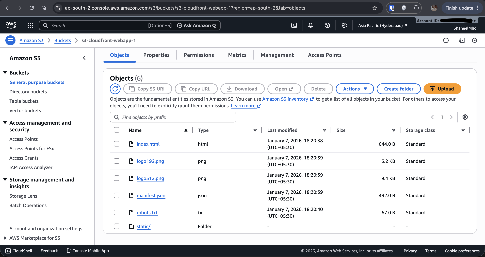
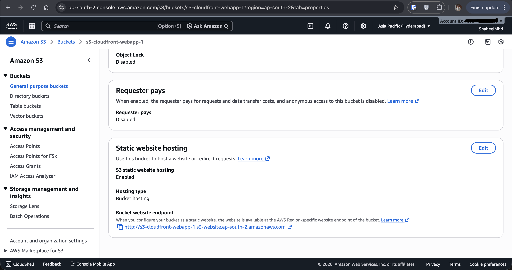
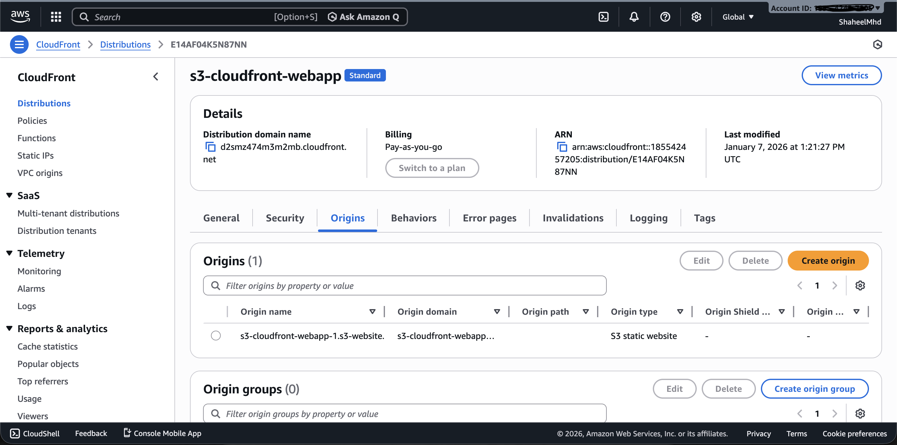
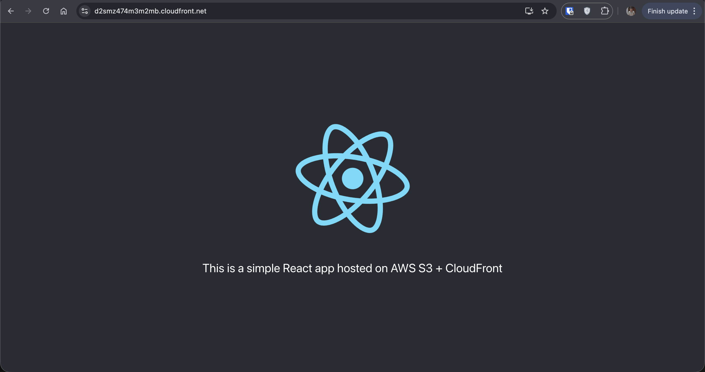

# Static web app hosted on AWS S3 + CloudFront
Hosted a React static web application using Amazon S3 and CloudFront, implementing CDN caching and HTTPS.

Visit the app using this [link](https://d2smz474m3m2mb.cloudfront.net/)

## Technologies used
- AWS S3 (Static Website Hosting)
- AWS CloudFront (CDN)
- IAM / S3 Bucket Policy
- HTTPS via CloudFront
- React (Static Build)

## Implementation details
- Configured S3 for static website hosting
- Used CloudFront to:
  - Serve content globally
  - Enable HTTPS
  - Cache static assets
- Set CloudFront Origin to S3 hosted website

## Screenshots

